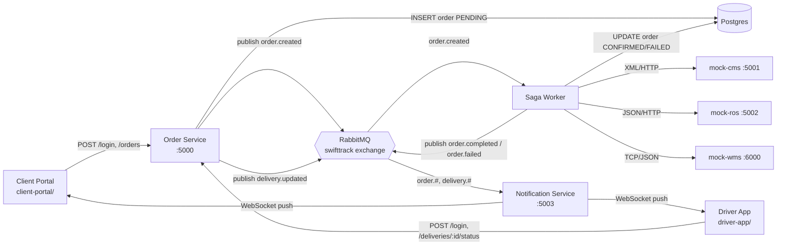

# SwiftTrack

A prototype delivery/logistics tracking platform built as a set of independent
microservices coordinated through a message broker, rather than one monolithic
app. It models a real-world scenario: a client submits a delivery order,
which then has to clear three separate backend systems — a Cargo Management
System (CMS), a Warehouse Management System (WMS), and a Route Optimisation
System (ROS) — each speaking its own protocol, without ever making the client
wait for that to finish.

## Why it's built this way

The core idea is **decoupling via a message queue**, combined with an
**orchestrated Saga** for the multi-step backend transaction:

- The client should never block on CMS/WMS/ROS — it gets a `202 Accepted`
  immediately, and the real work happens asynchronously.
- If one of the three backend steps fails partway through, whatever already
  succeeded needs to be undone (compensation), not left in a half-finished
  state.
- Delivery-status changes (a driver marking a package delivered) need to
  reach the client in real time, not on the next page refresh.

## Architecture



| Component | Role | Protocol it speaks |
|---|---|---|
| **Order Service** (`order-service/`) | Thin API: validates, persists `PENDING`, publishes an event, returns `202` immediately. Also handles JWT login and delivery-status updates. | HTTP/JSON |
| **Saga Worker** (`saga-worker/`) | Separate consumer process. Picks up `order.created`, drives CMS → WMS → ROS in sequence, compensates on failure, updates Postgres. | AMQP consumer |
| **mock-cms** | Stands in for a legacy on-prem CMS. | XML over HTTP |
| **mock-ros** | Stands in for a modern cloud route optimiser. | JSON/REST |
| **mock-wms** | Stands in for a proprietary warehouse protocol. | Newline-delimited JSON over raw TCP |
| **Notification Service** (`notification-service/`) | Subscribes to all `order.*`/`delivery.*` events, rebroadcasts over WebSocket. | AMQP consumer + Socket.IO |
| **Client Portal** (`client-portal/index.html`) | Log in, submit orders, watch them go live PENDING → CONFIRMED. | Static HTML/JS |
| **Driver App** (`driver-app/index.html`) | Log in, see confirmed orders as a manifest, mark delivered/failed. | Static HTML/JS |
| **RabbitMQ** | Topic exchange (`swifttrack`) decoupling every producer from every consumer. | AMQP |
| **Postgres** | Source of truth for order/delivery state and idempotency keys. | — |

## Patterns implemented

- **Orchestrated Saga + compensation** — `saga-worker/worker.py`'s
  `run_saga()`. If ROS fails after CMS/WMS already succeeded, it calls WMS's
  and CMS's cancel operations in reverse order.
- **Circuit breaker** — `pybreaker` wraps the ROS call; 3 consecutive
  failures trips it, 20s cooldown before retrying.
- **Competing consumers** — the Saga Worker's queue is `durable` with
  manual ack, so redelivery on a crash doesn't lose an order.
- **Idempotent consumer** — `process_order()` checks the order's current
  status before reprocessing, guarding against RabbitMQ redelivery.
- **Idempotency on the API** — a repeated `Idempotency-Key` header on
  `POST /orders` returns the original order instead of creating a duplicate,
  backed by a Postgres table so it survives a service restart.
- **Publish–subscribe** — the `swifttrack` topic exchange with `order.#`
  and `delivery.#` routing keys, so the Saga Worker and Notification
  Service each get only what they care about.
- **Protocol/data-translation adapters** — real XML built for CMS, JSON for
  ROS, newline-delimited TCP for WMS.

## Prerequisites

- [Docker Desktop](https://www.docker.com/products/docker-desktop/) (running)
- `curl` (or any HTTP client) for the demo commands below

## 1. Configure and start the complete stack

First create your local configuration file and replace its demo values:

```bash
cp .env.example .env
```

```bash
docker compose up --build -d
```

This starts every component in its own container:

- **RabbitMQ**: `localhost:5672` (management UI at `localhost:15672`; use the
  credentials in `.env`)
- **PostgreSQL**: `localhost:5432` (credentials and database name from `.env`) —
  `orders`, `idempotency_keys`, and `users` are created automatically from
  `init.sql` **on first start only** (see Troubleshooting if you change the
  schema later).
- **CMS / ROS / WMS mocks**: `localhost:5001`, `localhost:5002`, and
  `localhost:6000`
- **Order Service / Notification Service**: `localhost:5000` and
  `localhost:5003`
- **Client Portal**: `http://localhost:8080`
- **Driver App**: `http://localhost:8081`

Follow the services with:

```bash
docker compose ps
docker compose logs -f saga-worker
```

`docker compose up` waits for RabbitMQ and PostgreSQL health checks before
starting dependent services. No local Python installation or separate service
terminals are required.

## 2. Try it end to end

**Log in and submit an order**, either through the Client Portal at
`http://localhost:8080`,
or directly:

```bash
CLIENT_TOKEN=$(curl -s -X POST http://localhost:5000/login \
  -H "Content-Type: application/json" \
  -d '{"username":"client-demo","password":"change-this-client-password"}' | python -c "import sys,json;print(json.load(sys.stdin)['token'])")

curl -i -X POST http://localhost:5000/orders \
  -H "Content-Type: application/json" \
  -H "Authorization: Bearer $CLIENT_TOKEN" \
  -H "Idempotency-Key: demo-key-1" \
  -d '{"clientName": "Kandy Traders", "addresses": ["123 Galle Rd", "45 Duplication Rd"]}'
```

For the driver-only delivery endpoint, obtain a separate driver token:

```bash
DRIVER_TOKEN=$(curl -s -X POST http://localhost:5000/login \
  -H "Content-Type: application/json" \
  -d '{"username":"driver-demo","password":"change-this-driver-password"}' | python -c "import sys,json;print(json.load(sys.stdin)['token'])")
```

The response comes back `202` immediately with `"status": "PENDING"` —
before CMS/WMS/ROS have even been called. A moment later:

- The Saga Worker's terminal logs the CMS/WMS/ROS calls happening.
- `client-portal/index.html` flips that order's row to `CONFIRMED` live.
- Or query it directly: `curl http://localhost:5000/orders/<orderId>`

**Mark it delivered**, either via "Mark delivered" on the order's card in
`driver-app/index.html`, or:

```bash
curl -X POST http://localhost:5000/deliveries/<orderId>/status \
  -H "Content-Type: application/json" \
  -H "Authorization: Bearer $DRIVER_TOKEN" \
  -d '{"status": "DELIVERED"}'
```

Watch `client-portal/index.html` pick up the delivery status live in the
same row.

**Demo idempotency** — repeat the exact same curl command with the same
`Idempotency-Key`. You get the same `orderId` back and no second
`order.created` event fires (nothing new appears in the Saga Worker's
terminal).

**Demo saga compensation + the circuit breaker**:

```bash
curl -X POST http://localhost:5002/routes/toggle-failure -H "X-API-Key: change-this-ros-api-key"

curl -i -X POST http://localhost:5000/orders \
  -H "Content-Type: application/json" \
  -H "Authorization: Bearer $CLIENT_TOKEN" \
  -H "Idempotency-Key: demo-key-2" \
  -d '{"clientName": "Colombo Mart", "addresses": ["10 Marine Drive"]}'
```

Watch the Saga Worker's terminal: CMS and WMS both succeed, ROS fails, and
you'll see the compensating calls fire against CMS's `/cancel` and WMS's
cancel handling. The order ends up `FAILED` with `failedStep: "ros"`. Submit
two or three more orders (new `Idempotency-Key` each time) while failure
mode is still on — a later attempt should trip the circuit breaker, and the
failure reason will say "circuit breaker open" instead of a raw connection
error. **Toggle failure mode off again afterwards**
(`curl -X POST http://localhost:5002/routes/toggle-failure -H "X-API-Key: change-this-ros-api-key"`).

## API reference

| Method | Path | Auth | Notes |
|---|---|---|---|
| `POST` | `/login` | Username + password | Issues a JWT with the configured client or driver role |
| `POST` | `/orders` | Client JWT + `Idempotency-Key` header | Returns `202` immediately |
| `GET` | `/orders/<id>` | JWT | Clients can view only their own orders; drivers can view operational orders |
| `POST` | `/deliveries/<id>/status` | Driver JWT | `status` must be `DELIVERED` or `FAILED` |
| `GET` | `/health` | — | On every service |
| `POST` | `/routes/toggle-failure` | ROS API key | mock-ros only, flips simulated ROS outage on/off |

## Project structure

```
order-service/       Order API: validation, 202-immediately, auth, idempotency
saga-worker/          Saga orchestration, compensation, circuit breaker
mock-cms/, mock-ros/, mock-wms/   Simulated backend systems, one protocol each
notification-service/ RabbitMQ → WebSocket bridge
client-portal/        Client-facing static UI
driver-app/           Driver-facing static UI
shared/               CSS shared by both UIs
docker-compose.yml     RabbitMQ + Postgres only — app services run as plain
                       python processes for now (see ROADMAP.md)
init.sql              Schema: orders, idempotency_keys, users
```

## Known limitations

This is a prototype built incrementally across a multi-week assignment.
Current gaps (tracked in more detail in `ROADMAP.md`):

- Browser connections use JWTs and client events are scoped to the owner;
  drivers receive the operational manifest. Driver assignment per individual
  driver is not yet implemented.
- `.env` is deliberately excluded from Git. `.env.example` contains only
  replaceable local demo values.
- CMS uses HTTP Basic Authentication, ROS uses an API key, and the WMS TCP
  protocol uses a shared service token. These are demonstration controls;
  production deployment still requires TLS or mTLS/VPN protection.
- No TLS anywhere (acceptable for local dev; a real deployment would
  terminate TLS at a gateway/load balancer).
- No retry/backoff on the WMS TCP call, and no automated tests exist yet.
- Only `postgres` and `rabbitmq` are containerized — the app services
  aren't, so "scale to more instances" isn't demonstrable via Docker yet.

## Troubleshooting

**A duplicate/orphaned service process is silently eating your events.**
On Windows in particular, stopping a background terminal doesn't always
kill the Python process it launched. If `notification-service` seems to
receive events (check its terminal or add a `print` in `on_message`) but
your browser never gets a live update, check whether more than one process
is bound to port `5003`:

```powershell
Get-NetTCPConnection -LocalPort 5003
Get-CimInstance Win32_Process -Filter "Name='python.exe'" | Select-Object ProcessId, CommandLine
```

Kill every stale one (`Stop-Process -Id <id> -Force`) and start a single
fresh instance. This exact issue is why `notification-service` should
always be (re)started cleanly rather than assumed to still be the same
process you started an hour ago.

**RabbitMQ takes 20-30 seconds to fully start.** `docker compose up -d`
returns as soon as the container starts, not once RabbitMQ's AMQP listener
is actually accepting connections. If `saga-worker` or
`notification-service` crash immediately with
`pika.exceptions.IncompatibleProtocolError` or `StreamLostError`, RabbitMQ
likely wasn't ready yet — just restart them once `docker logs
swifttrack-rabbitmq` shows `Server startup complete`.

**Changed `init.sql` but Postgres doesn't have the new table/column.**
Docker only runs `docker-entrypoint-initdb.d` scripts the *first* time a
volume is created. If you add a table to `init.sql` after Postgres has
already been running, apply it manually instead of recreating the volume
(which would drop existing data):

```bash
docker exec swifttrack-postgres psql -U swift -d swifttrack -c "<your new CREATE TABLE statement>"
```

**The client portal / driver app table looks empty after a refresh.** This
is expected, not a bug — both pages are pure live views with no history:
they only render events received over the WebSocket *after* the page
connects. The real data lives in Postgres regardless; check it with
`GET /orders/<id>` or the query below.

**Inspecting Postgres directly:**

```bash
docker exec -it swifttrack-postgres psql -U swift -d swifttrack -c "SELECT * FROM orders;"
```

Or connect a GUI (DBeaver, pgAdmin, the PostgreSQL VS Code extension) using
the PostgreSQL host, user, password, and database values in `.env`.
